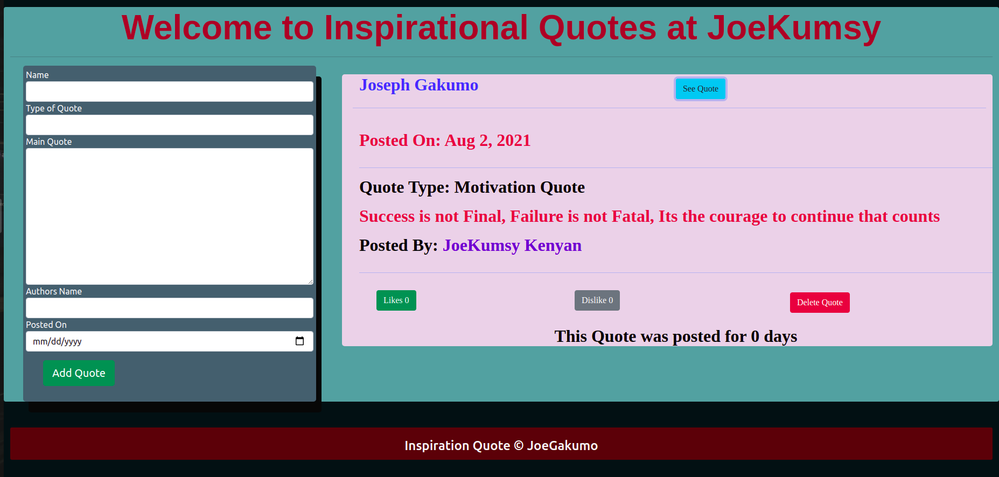

# Quotes App
## Project Describtion
Quotes App is a website that is designed using Angular CLI.The website allows the user to create his own quote and post it on the site , it also indicate when the quote was posted and the likes and dislike the quote has achieved.
This project was generated with [Angular CLI](https://github.com/angular/angular-cli) version 12.2.0.

# Setup Installation
 the website is hosted at Git so incase you need a copy ensure you are in the right folder then type the following
 * git clone https://github.com/JoeGakumo21/Quotes-App
 # setup requirements
 * browser
 * github
# Technology used
* HTML
* CSS
* BOOTSTRAP
* JAVASCRIPT
* JQUERY
* TYPESCRIPT
# Live link
access the website via this link <a href="https://joegakumo21.github.io/Quotes-App/">Quote App generator</a>

# Contact
    incase of any comment reach me via

tel :0791279635
email :joegakumo1@gmail.com
## Development server

Run `ng serve` for a dev server. Navigate to `http://localhost:4200/`. The app will automatically reload if you change any of the source files.

## Code scaffolding

Run `ng generate component component-name` to generate a new component. You can also use `ng generate directive|pipe|service|class|guard|interface|enum|module`.

## Build

Run `ng build` to build the project. The build artifacts will be stored in the `dist/` directory.

## Running unit tests

Run `ng test` to execute the unit tests via [Karma](https://karma-runner.github.io).

## Running end-to-end tests

Run `ng e2e` to execute the end-to-end tests via a platform of your choice. To use this command, you need to first add a package that implements end-to-end testing capabilities.

## Further help

To get more help on the Angular CLI use `ng help` or go check out the [Angular CLI Overview and Command Reference](https://angular.io/cli) page.

<a href="https://choosealicense.com/licenses/mit/">MIT LICENCE</a> 

* &copy;2021 Joseph Gakumo